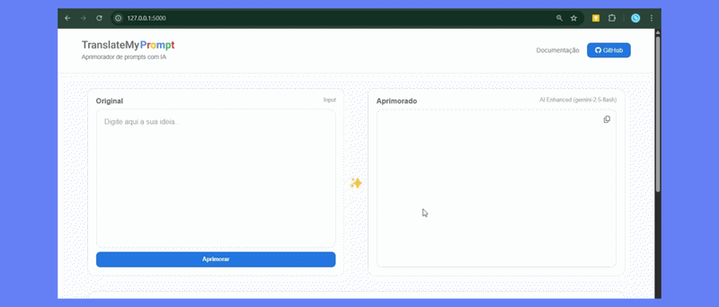

## TranslateMyPrompt 💻

Aplicação web para análise, pontuação e otimização de prompts utilizando IA generativa. O sistema recebe um prompt simples, aplica boas práticas de *prompt engineering* e retorna:

- Versão otimizada
- Score de qualidade (0–100)
- Pontos fortes
- Sugestões de melhoria

### 📽️ Demonstração

**Interface simples com dois painéis:**

- Entrada do prompt (usuário)
- Saída otimizada (IA)

**Inclui:**

- Score visual com barra de progresso
- Feedback estruturado
- Botão de "copy"
  

---

### 🧩 Tecnologias Utilizadas

O projeto segue uma arquitetura simples de backend + frontend, com integração a modelos generativos:

**Backend**
- Python + Flask  
- Integração com API do Gemini  
- Orquestração dos agentes de IA (geração + avaliação)  

**Frontend**
- HTML + CSS + JavaScript 
- Comunicação via Fetch API  

**IA / Multiagentes**
- Modelo: Gemini 2.5 Flash Lite  
- Agente 1: otimização do prompt  
- Agente 2: avaliação (score + feedback estruturado)  

---

## ⚙️ Como rodar

#### **1. Faça o Download do repositório**
`https://github.com/Karina-Lima/TransalteMyPrompt/`

#### **2. Instale as dependências**

`pip install -r requirements.txt `

#### **3. Altere o arquivo .env na raiz com sua chave Gemini:**

Gere uma chave na plataforma do Google AI ou utilize uma já existente.

`GEMINI_API_KEY=sua_chave_aqui`

#### **4. Execute o projeto**
`python app.py`

#### **5. Acesse a URL**
`http://localhost:5000`
